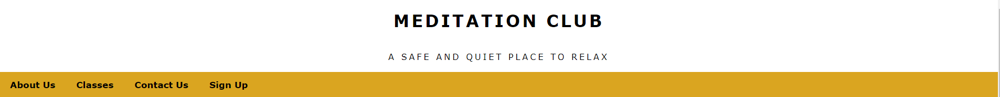
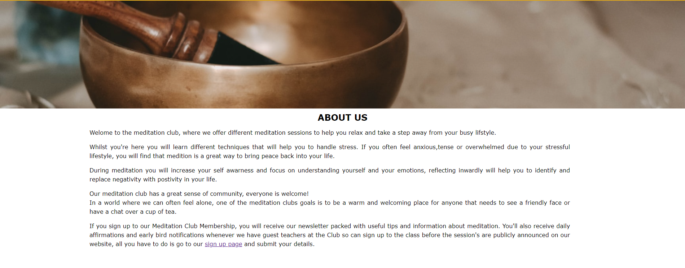
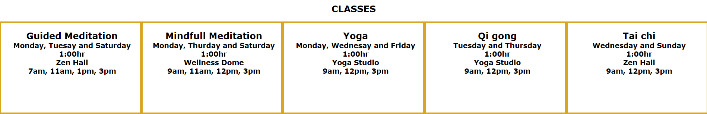
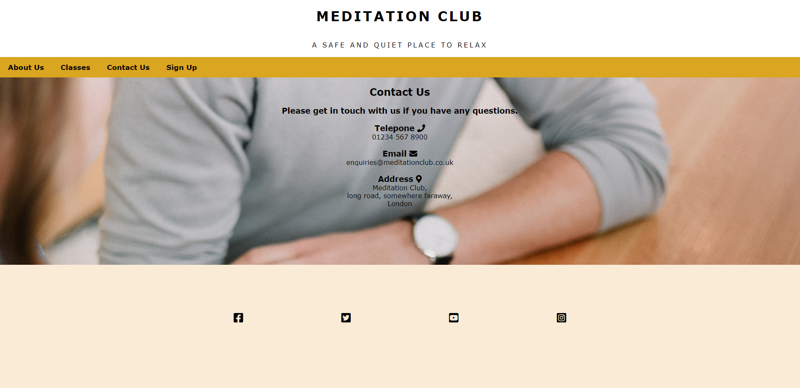
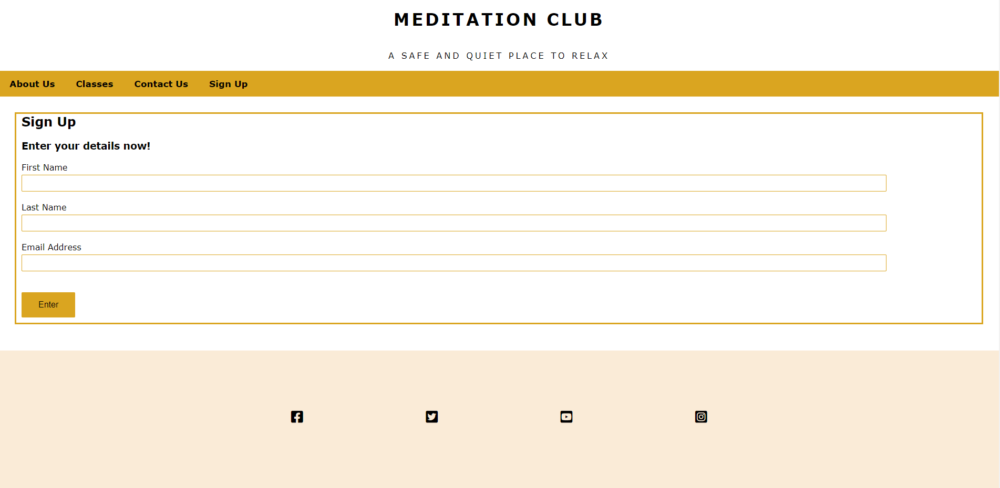
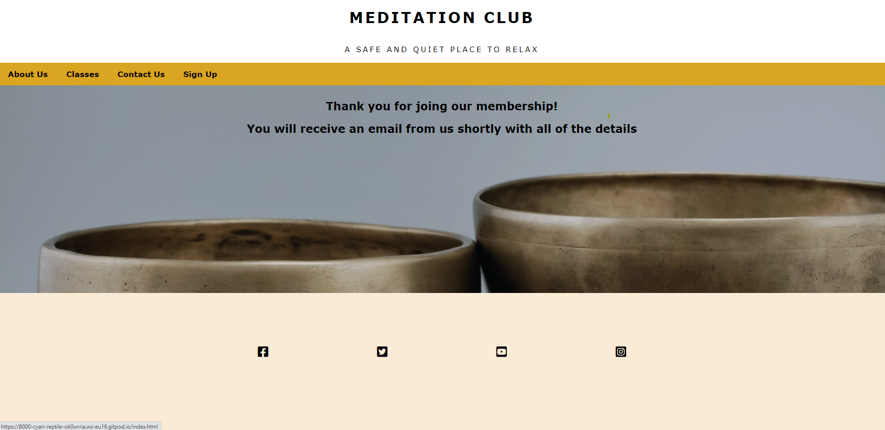

# Project 1 - Meditation Club

Meditation Club is a website designed to offer its users basic information about what the Meditation Club has to offer it's visitors, the website includes information on what kind of meditation classes our offer, when and where the classes are run, how to contact the Meditation Club and information about the free membership scheme on offer. 

## Features

### Logo
- i decided to centre the logo on the website this design is consistant throughout the website. 

### Navigation Bar
- The navigation bar includes links to the About and Classes section of the homepage, the Contact Us page and the Sign Up page. 
the navigation bar looks the same on each page giving the website a uniform look and making it easy for user to move between pages on the website. 

# Front page

## Hero image and About section

- On the Front page of the website you will find the hero image and two sections of information. The hero image is of a singing bowl and animation has been applied to this image to catch the eye of the user. I took the idea to use a hero image with animation from the Love Running Project i completed during the one of the modules in the code institute course, i thought it was a good way to add an extra layer of interest to the website. 

- The first section of information is the About section, here the user with find out more about the Meditation Club there is also some information on a few of the benefits of meditation and there is information about the Meditation Club Membership scheme and there is also a link to the sign up page.  

## Classes section
- The second section of the information on the front page is the Classes section. This is where the user will find out which day of the week each class is held, what time the classes are run and in which room within the Meditation club each class takes place. 

- I also chose to style this section of the page in a same way I was taught to style a section of the Love Running project as liked how clear and easy to read the information was presented.

## Contact Us page

- This page contains details on how to contact the Meditation Club and where to find the them in central London. 
The information on the page has been center and next to each heading the a icon representing each method of contact.  

## Sign Up page
- This page is where users sign up to the Meditation Club membership and receive the meditation club news letter and daily affirmations and early bird notification when guest teachers are due to vist the club. Its a free memebrship so the only information user are requires to provide is their first name, last name and email address. 

## Thank you page
- After the user submits their information into the sign up form, they are presented with a thank you message

## Footer 
- The footer contains links to various different social media pages, each represented by the social media icon. when the user sellects an icon the social media homepage will open in a new tab. 

## Future Ideas,
- If had more time I would like to have had an extra page with guidance on how meditation can be practised at home and on the go and a blog page.i would also like to include an events page.  

## Testing
- After writting the HTML code and most of the CCS code I decide to test the website and see how it would function on different screen sizes and added in media screen styling,
during this process i took the time to focus on the sections of the website that contained the most text, i felt that it's important for the body of information to be accessesable no matter the screen size, I chose to write code for screens 1200px and below and 950px and below snd use the knowledge i had gained during the Love Running project. 
- I used the dev tools on google chrome to help me through the process of changing the margin,padding and width sizes. 
- The section that needed the most attention were the About section and Classes section on the front page and the input field on the Sign Up page needed to be resized when reduced down the 950px and below. 
- i also had to resize my background images to kae sure they fit well onto the website

### Validator Testing
* After running my HTML code through the validator it higlighted to me that I had incorrectly used a `<li>` element. I was using it as a directchild of the `<nav>` element, iquickly fixed this by placing a `<ul>` abd it's closing tag inbetween the `<nav>` and the `<li>`.

* The HTML validator also higlited my incorrect use of a `` element, i had placed a blcok element `<h3>` within a ``. To fix this I changed the `` to a `
` 

* No errors were found when i put my CSS code through the CSS code validator. 

* The validators i used were https://validator.w3.org/nu/ and https://jigsaw.w3.org/css-validator/ 
 
## Deployment

- This site was deployed using github pages. please find a live link the webisite below.  

## Credits
- As i mentioned previously in this file i have taken some style ideas from the Love Running project i completed before building this website. 

- The icons used in the footer of the website and on the Contact Us page can be found on the font awesom website https://fontawesome.com/

- The image i used for hero image was found on https://unsplash.com/ 
