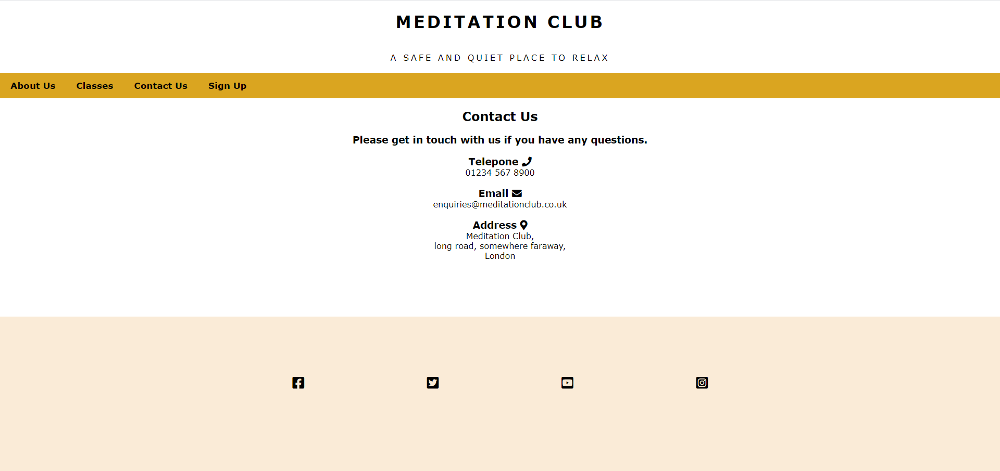
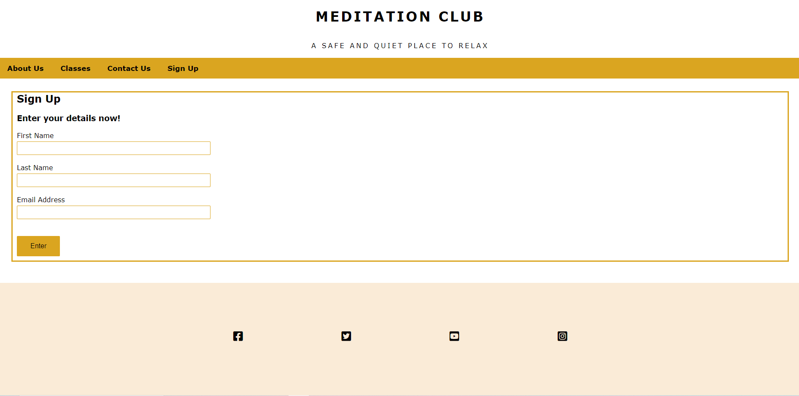

# Project 1 - Meditation Club

Meditation Club is a website designed to offer its users basic information about what the Meditation Club has to offer it's visitors, the website includes information on what kind of meditation classes our offer, when and where the classes are run, how to contact the Meditation Club and information about the free membership scheme on offer. 

## Features

### Logo
- i decided to centre the logo on the website this design is consistant throughout the website. 

### Navigation Bar
- The navigation bar includes links to the About and Classes section of the homepage, the Contact Us page and the Sign Up page. 
the navigation bar looks the same on each page giving the website a uniform look and making it easy for user to move between pages on the website. 

# Front page

## Hero image and About section

On the Front page of the website you will find the hero image and two sections of information. The hero image is of a singing bowl and animation has been applied to this image to catch the eye of the user. I took the idea to use a hero image with animation from the Love Running Project i completed during the one of the modules in the code institute course, i thought it was a good way to add an extra layer of interest to the website. 

The first section of information is the About section, here the user with find out more about the Meditation Club there is also some information on a few of the benefits of meditation and there is information about the Meditation Club Membership scheme and there is also a link to the sign up page.  

## Classes section
The second section of the information on the front page is the Classes section. This is where the user will find out which day of the week each class is held, what time the classes are run and in which room within the Meditation club each class takes place. 

I also chose to style this section of the page in a same way I was taught to style a section of the Love Running project as liked how clear and easy to read the information was presented.

## Contact Us page

This page contains details on how to contact the Meditation Club and where to find the them in central London. 
The information on the page has been center and next to each heading the a icon representing each method of contact.  

## Sign Up page
This page is where users sign up to the Meditation Club membership and receive the meditation club news letter and daily affirmations and early bird notification when guest teachers are due to vist the club. Its a free memebrship so the only information user are requires to provide is their first name, last name and email address. 

## Footer 

testing

bugs and fixes 

deplyment

credits

